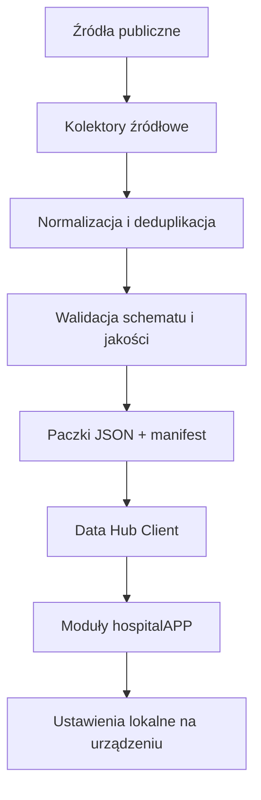
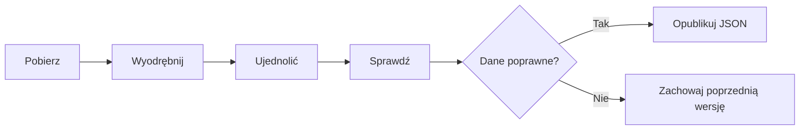

# HospitalAPP Data Hub

Status: architektura wersji 1.0  
Data decyzji: 25.07.2026 r.  
Właściciel produktu: hospitalAPP

## 1. Decyzja w jednym zdaniu

HospitalAPP korzysta z jednej, niewidocznej dla użytkownika warstwy Data Hub, która dziś publikuje przetworzone dane jako małe, wersjonowane paczki JSON w GitHubie, a w przyszłości może podać ten sam format przez API i Supabase bez przebudowy ekranów aplikacji.

## 2. Co Data Hub przechowuje

Data Hub przechowuje wyłącznie dane przydatne do analizy:

- ujednolicone metadane;
- wartości i wskaźniki;
- identyfikatory źródłowe;
- linki do oryginalnych dokumentów;
- status kompletności i weryfikacji;
- gotowe, zweryfikowane streszczenia;
- datę pobrania oraz źródło każdego rekordu.

Data Hub nie przechowuje:

- kopii całych stron internetowych;
- pobranych hurtowo PDF, SWZ, umów ani sprawozdań;
- surowego HTML;
- danych użytkownika;
- ustawień i kalkulacji wykonanych na telefonie;
- kluczy API;
- danych medycznych ani innych danych wrażliwych.

Dokument może zostać pobrany tymczasowo podczas działania kolektora, przetworzony, a następnie usunięty. W repozytorium pozostają wyłącznie wynik ekstrakcji oraz link do źródła.

## 3. Architektura



Najważniejsza zasada: moduły aplikacji nie znają fizycznego miejsca przechowywania danych. Pytają klienta Data Hub o nazwany zbiór, np. `procurements` albo `legislation`.

W wersji 1.0 klient odczytuje pliki JSON z GitHub Pages. W przyszłości ten sam klient może otrzymać w manifeście adres API lub magazynu obiektowego.

## 4. Struktura katalogów

Struktura działająca od wersji 1.0:

```text
hospitalapp/
├── app.js
├── data-hub.js
├── index.html
├── sw.js
├── data/
│   ├── mz-legislation.json
│   ├── jgp-*.js
│   ├── nfz-*.js
│   └── cost-accounting*.js
├── data-hub/
│   ├── manifest.json
│   ├── sources.json
│   ├── schemas/
│   │   ├── procurement.schema.json
│   │   └── financial-result.schema.json
│   └── datasets/
│       ├── procurements/
│       │   ├── index.json
│       │   └── shards/
│       │       ├── 2022.json
│       │       └── 2025.json
│       └── financial-results/
│           └── index.json
├── scripts/
│   ├── sync_mz_legislation.py
│   ├── sync_nfz_contract.py
│   ├── validate_data_hub.py
│   └── collectors/                  # następny etap
│       ├── common/
│       ├── bzp/
│       ├── ted/
│       ├── ekrs/
│       ├── nfz/
│       ├── aotmit/
│       ├── rcl/
│       └── hospital_bip/
├── tests/
└── .github/workflows/
```

Po uruchomieniu kolejnych kolektorów każdy powinien mieć własny katalog. Kod wspólny, np. obsługa pobierania, ponowień, dat i logów, powinien trafić do `scripts/collectors/common/`.

## 5. Manifest

Plik `data-hub/manifest.json` jest spisem treści całego Data Hub. Zawiera:

- wersję wspólnego kontraktu;
- wersję aplikacji;
- listę zbiorów;
- status każdego zbioru;
- używany sposób odczytu;
- ścieżkę do pliku albo indeksu paczek;
- liczbę rekordów;
- źródła;
- datę aktualizacji.

Statusy zbioru:

| Status | Znaczenie |
|---|---|
| `active` | kompletny moduł lub działający automatyczny proces |
| `pilot` | działający, mały zbiór sprawdzający format i ekran |
| `prepared` | schema i katalog są gotowe, ale nie ma jeszcze regularnych danych |
| `planned` | praca zaplanowana, bez wdrożonego kontraktu |

Adaptery:

| Adapter | Zastosowanie |
|---|---|
| `single-json` | mały zbiór w jednym pliku, np. legislacja |
| `sharded-json` | zbiór podzielony na małe paczki |
| `legacy-js` | istniejące dane wersji 0.9, jeszcze nieprzeniesione do JSON |
| `local-only` | kalkulatory i dane użytkownika na urządzeniu |
| `none` | zbiór przygotowany lub planowany |

Docelowo można dodać adaptery `object-storage` i `http-api` bez zmiany formatu rekordów.

## 6. Format paczki JSON

Każda paczka ma kopertę:

```json
{
  "schemaVersion": "1.0.0",
  "dataset": "procurements",
  "generatedAt": "2026-07-25T00:00:00+02:00",
  "partition": {
    "key": "2025",
    "immutable": false
  },
  "records": []
}
```

Zasady:

1. `schemaVersion` pozwala kontrolować zgodność danych i aplikacji.
2. `dataset` jednoznacznie identyfikuje typ danych.
3. `generatedAt` mówi, kiedy przygotowano paczkę.
4. `partition.key` określa fragment zbioru, np. rok.
5. Stare, zamknięte paczki mają `immutable: true` i nie są przepisywane.
6. Pojedyncza paczka nie powinna przekraczać 5 MB.
7. Rekord ma stabilny identyfikator zawierający system źródłowy, np. `bzp:ocds-...`.

### Rekord przetargu

```json
{
  "id": "bzp:ocds-...",
  "hospital": {
    "name": "Nazwa szpitala",
    "krs": null,
    "regon": null
  },
  "subject": "Świadczenie usług sterylizacji",
  "referenceNumber": "DZP/1/2026",
  "category": "Usługi sterylizacji",
  "cpv": [],
  "status": "Zakończone – zawarta umowa",
  "dates": {
    "published": "2026-01-10",
    "updated": null,
    "awarded": null
  },
  "value": {
    "amount": null,
    "currency": "PLN",
    "kind": "unknown",
    "status": "not-extracted"
  },
  "contractor": {
    "name": null,
    "status": "not-extracted"
  },
  "documents": [
    {
      "type": "swz",
      "title": "SWZ – karta postępowania",
      "url": "https://...",
      "availability": "source-page"
    }
  ],
  "source": {
    "system": "BZP / e-Zamówienia",
    "sourceId": "ocds-...",
    "url": "https://...",
    "retrievedAt": "2026-07-25T00:00:00+02:00"
  },
  "aiSummary": {
    "status": "pending",
    "text": null,
    "generatedAt": null,
    "model": null,
    "basedOn": []
  }
}
```

Brak wartości nie jest zastępowany zerem ani domysłem. Pole otrzymuje `null` oraz jawny status, np. `not-extracted`.

### Rekord wyniku finansowego

Rekord eKRS ma następujące główne sekcje:

- `hospital`: nazwa, KRS, opcjonalnie REGON;
- `period`: początek, koniec i rok sprawozdania;
- `statement`: przychody, koszty, wynik netto, aktywa, zobowiązania i środki pieniężne;
- `indicators`: obliczone wskaźniki;
- `source`: typ dokumentu, link oraz data pobrania.

Nie przechowujemy pliku PDF/XML po zakończeniu przetwarzania, o ile nie okaże się on konieczny do zapewnienia audytowalności. W pierwszym etapie wystarczą dane, wskaźniki i link.

## 7. Proces pobierania danych

Każdy kolektor przechodzi te same etapy:

1. **Sprawdź źródło** – pobierz listę nowych lub zmienionych pozycji.
2. **Pobierz tymczasowo** – tylko dokumenty potrzebne do ekstrakcji.
3. **Wyodrębnij** – odczytaj potrzebne pola.
4. **Normalizuj** – ujednolić daty, kwoty, nazwy i statusy.
5. **Nadaj stabilny identyfikator** – najlepiej na podstawie identyfikatora źródłowego.
6. **Deduplikuj** – nie twórz drugiego rekordu tego samego postępowania lub sprawozdania.
7. **Oblicz wskaźniki** – tylko według wersjonowanych, opisanych reguł.
8. **Waliduj** – sprawdź schemat, linki, liczby rekordów i zakazane surowe treści.
9. **Opublikuj** – zmień wyłącznie właściwą paczkę i manifest.
10. **Zachowaj ostatnią dobrą wersję** – błąd źródła nie może wyczyścić zbioru.



### Zasada różnicowa

Kolektor powinien pobierać pozycje nowe lub zmienione od ostatniego udanego uruchomienia. Pełne przeliczenie całej historii wykonujemy tylko:

- przy zmianie schematu;
- przy poprawie parsera;
- przy ręcznym zadaniu administracyjnym;
- przy kontroli jakości.

### AI

AI nie jest częścią podstawowego pobierania. Najpierw powstaje zweryfikowany rekord i lista dokumentów. Dopiero osobny etap może:

1. pobrać wskazane dokumenty;
2. przygotować streszczenie;
3. zapisać, na podstawie których dokumentów je sporządzono;
4. nadać status `review-required`;
5. po kontroli zmienić status na `ready`.

Klucz API nigdy nie trafia do aplikacji na iPhone.

## 8. Harmonogram GitHub Actions

Harmonogram docelowy powinien być rozłożony, aby procesy nie uruchamiały się jednocześnie:

| Źródło / proces | Częstotliwość | Proponowana godzina UTC | Wersja |
|---|---:|---:|---|
| BZP / e-Zamówienia | codziennie | 02:10 | 1.1 |
| TED | codziennie | 02:40 | 1.2 |
| Legislacja MZ / RCL | codziennie | 04:17 | działa |
| AOTMiT | codziennie | 04:45 | 1.2 |
| NFZ – komunikaty i katalogi | poniedziałek–piątek | 03:15 | 1.1 |
| NFZ – profile umów | raz w tygodniu | niedziela 03:45 | 1.1 |
| eKRS – sprawozdania | raz w tygodniu | sobota 01:20 | 1.1 |
| BIP szpitali | raz w tygodniu | sobota 03:20 | 1.2 |
| Pełna walidacja Data Hub | po każdej zmianie + niedziela | 05:15 | 1.0 / 1.1 |

GitHub używa w harmonogramach UTC. Godzina w Polsce przesuwa się wraz ze zmianą czasu. Jeżeli wymagana jest zawsze dokładnie godzina 06:17 czasu polskiego, workflow musi uwzględnić zmianę czasu albo być uruchamiany przez usługę rozumiejącą strefę `Europe/Warsaw`.

Wersja 1.0 automatyzuje już:

- codzienne sprawdzanie legislacji;
- kontrolę integralności Data Hub przy każdej zmianie jego plików;
- blokadę publikacji niepoprawnych rekordów.

## 9. Bezpieczeństwo i jakość danych

Obowiązkowe mechanizmy:

- walidacja wszystkich paczek przed publikacją;
- unikalność identyfikatorów;
- pełne adresy HTTPS do źródeł;
- oddzielenie `0` od `brak danych`;
- data pobrania w każdym rekordzie;
- jawny status weryfikacji wartości;
- brak nadpisania poprawnego zbioru pustym wynikiem;
- alarm przy nagłym dużym spadku liczby rekordów;
- ograniczenie paczki do 5 MB;
- brak surowej treści dokumentów w polach rekordu;
- test aplikacji po zmianie schematu;
- jeden właściciel definicji wskaźnika i jego wersji.

Warto dodać w wersji 1.1:

- raport jakości widoczny w GitHub Actions;
- liczbę nowych, zmienionych i odrzuconych rekordów;
- kontrolę dostępności linków;
- kolejkę rekordów wymagających ręcznej weryfikacji;
- słownik aliasów nazw szpitali;
- główny identyfikator szpitala oparty na KRS/REGON.

## 10. Skalowanie bez przebudowy

GitHub jest dobry dla wersji 1.0, ale nie jest magazynem milionów rekordów.

Oficjalne limity wskazują, że:

- pliki powyżej 50 MiB generują ostrzeżenie, a powyżej 100 MiB są blokowane;
- repozytoria powinny pozostać możliwie małe, najlepiej poniżej 1 GB;
- opublikowana strona GitHub Pages ma limit 1 GB i miękki limit transferu 100 GB miesięcznie.

Źródła:

- [GitHub – duże pliki i rozmiar repozytorium](https://docs.github.com/en/repositories/working-with-files/managing-large-files/about-large-files-on-github)
- [GitHub Pages – limity](https://docs.github.com/en/pages/getting-started-with-github-pages/github-pages-limits)
- [GitHub Actions – użycie i koszty](https://docs.github.com/en/billing/concepts/product-billing/github-actions)

Dlatego przyjmujemy własne, wcześniejsze progi migracji. Rozpoczynamy przenoszenie ciężkich zbiorów poza repozytorium, gdy wystąpi pierwszy z warunków:

- opublikowane dane przekroczą około 50 MB;
- jeden zbiór przekroczy około 100 000 rekordów;
- typowe wyszukiwanie na telefonie trwa dłużej niż 2 sekundy;
- aktualizacja zaczyna przepisywać dziesiątki megabajtów dziennie;
- potrzebne staje się wyszukiwanie pełnotekstowe po milionach rekordów.

Kolejność migracji:

1. Kod, schematy i manifest pozostają w GitHubie.
2. Zamknięte paczki JSON trafiają do magazynu obiektowego z CDN.
3. Manifest otrzymuje zewnętrzne adresy paczek.
4. Dla bardzo dużej skali dochodzi API wyszukiwania.
5. Supabase/PostgreSQL pojawia się w wersji 2.0 dla kont, synchronizacji i danych prywatnych.

Format rekordu pozostaje ten sam. Zmienia się adapter, nie moduł aplikacji.

## 11. Plan rozwoju 0.9–2.0

### 0.9 – działające narzędzia lokalne

- Gruper JGP;
- Legislacja MZ;
- Rachunek kosztów;
- 20 pytań i odpowiedzi;
- kalkulator skutków wzrostu płac;
- dane użytkownika tylko lokalnie.

### 1.0 – fundament Data Hub

- wspólny manifest danych;
- rejestr źródeł;
- wersjonowane schematy;
- klient Data Hub;
- paczki JSON;
- automatyczna walidacja;
- pilot wyszukiwarki przetargów;
- przygotowany pusty zbiór wyników finansowych;
- pełna zgodność z dotychczasowymi modułami 0.9.

### 1.1 – pierwsza regularna hurtownia

- automatyczny kolektor BZP;
- import i parser sprawozdań eKRS;
- słownik szpitali KRS/REGON/nazwa;
- wyodrębnianie wartości, wykonawców i typów dokumentów;
- pierwsze benchmarki finansowe;
- raport jakości po każdym uruchomieniu.

### 1.2 – rozszerzenie źródeł

- TED;
- AOTMiT;
- wybrane BIP i strony szpitali;
- odpowiedzi na pytania i projekty umów;
- porównania sposobu organizacji podobnych zamówień;
- kolejka kontrolowanych streszczeń AI.

### 1.5 – duża skala publicznych danych

- paczki historyczne poza repozytorium;
- CDN lub magazyn obiektowy;
- generowany indeks wyszukiwania;
- API wyszukiwania, gdy wyszukiwanie statyczne przestanie wystarczać;
- monitoring dostępności źródeł i kosztów.

### 2.0 – konta i współdzielenie

- Supabase/PostgreSQL;
- konta użytkowników;
- synchronizacja między urządzeniami;
- prywatne notatki i kalkulacje;
- współdzielenie w zespołach;
- panel administratora;
- uprawnienia i historia zmian.

## 12. Co automatyzować teraz, a co później

### Teraz

- jednolity manifest;
- schematy rekordów;
- walidację i testy;
- stabilne identyfikatory;
- deduplikację;
- datę pobrania i link do źródła;
- podział danych na paczki;
- zachowanie ostatniej poprawnej wersji;
- legislację;
- mały pilot BZP sprawdzający ekran i kontrakt danych.

### Wersja 1.1

- regularny kolektor BZP;
- parser eKRS;
- słownik szpitali;
- kontrolę nagłych spadków rekordów;
- raport błędów i danych niekompletnych;
- wyodrębnianie wykonawcy i wartości.

### Później

- pobieranie i analiza wszystkich załączników;
- OCR skanów;
- masowe streszczenia AI;
- crawler wszystkich BIP;
- TED;
- własny silnik wyszukiwania;
- konta, panel administratora i Supabase.

Najpierw budujemy niezawodny rekord i link do źródła. Dopiero później dokładamy kosztowne przetwarzanie dokumentów oraz AI.

## 13. Prosta instrukcja dla właściciela projektu

Na etapie wersji 1.0 nie musisz zakładać żadnego nowego konta ani bazy.

Twoje działania:

1. Oceniasz, czy rekord i ekran przetargu pokazują informacje użyteczne zarządczo.
2. Wskazujesz pierwszą listę 20–50 szpitali lub tematów do pilota BZP/eKRS.
3. Sprawdzasz przykładowe wyniki z oficjalnym źródłem.
4. Akceptujesz nazwy wskaźników finansowych.
5. Dopiero po udanym pilocie uruchamiamy regularne, masowe pobieranie.

Sprawy techniczne – struktura plików, testy, harmonogram i publikacja – mogą pozostać całkowicie po stronie automatyzacji.

## 14. Kryteria ukończenia wersji 1.0

Wersja 1.0 jest gotowa, gdy:

- dotychczasowe moduły 0.9 nadal działają;
- aplikacja otwiera moduł Przetargi;
- hasło `sterylizacja` zwraca rekordy z kilku szpitali;
- każdy rekord prowadzi do oficjalnego źródła;
- brakujące wartości nie są zgadywane;
- Data Hub przechodzi walidację;
- aplikacja działa na wąskim ekranie i offline po pierwszym uruchomieniu;
- testy automatyczne przechodzą;
- wersja aplikacji, manifest i pamięć offline są oznaczone jako `1.0.0`.
